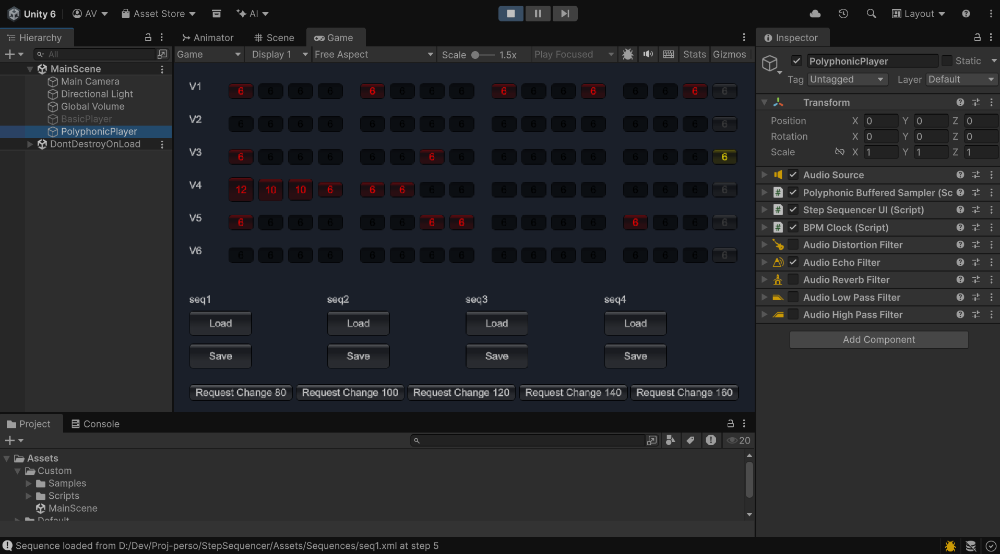

# StepSequencer
This Unity (6.3 LTS) project provides a StepSequencer that can manage tempo changes.

Actually, it can load/save 4 voices of 16 steps from XML. It can then play them through a custom AudioFilter that mixes WAV files to its output.

The BPM holder makes use of AudioSettings.dspTime (for precision) to schedule play events at BPM/StepsPerBeat.

# Goal
This project emerged from the game design of a multiplayer game (rogue-lite), where one of the characters is fragile and must be supported and carried to a safer place. His health is critical to the players, and it's expressed as a beat!

This beat can evolve from 40 to 140 BPM, and we would like to be able to produce generative music that supports this.

# Usage

## General Usage

* Playing is always enabled; steps are visible.
* Click a step to enable it.
* Drag a step to change the pitch (expressed as a note offset 0–12 for one octave).
* Load/save sequences (4 XML files included), without time synchronization.
* Request tempo changes, with tempo morphing.

## Tempo Morphing

Tempo morphing is the heart of the game design for this project.

When you request a tempo change, the sequencer:
* Waits for the end of the step sequence to load a transition sequence (designed as a simple heartbeat).
* Changes the BPM every 4 beats of the transition sequence.
* Loads another sequence when exiting the transition.

# Contributions

This is a personal project; I'll use it for my own purposes and probably for projects in my current company (game development).

The intention is to release it under the MIT license so it can grow on its own and eventually accept contributions from others, but without any guarantees — from indie developers to indie projects.